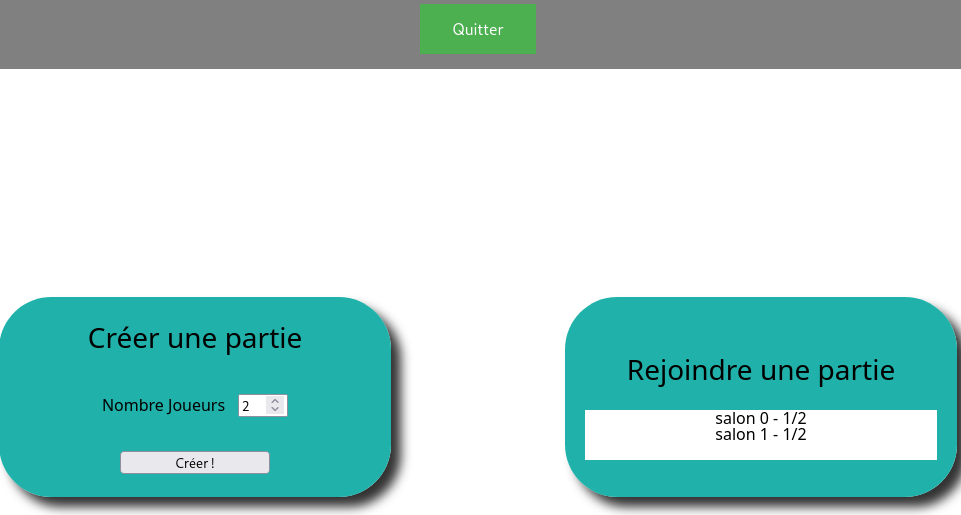
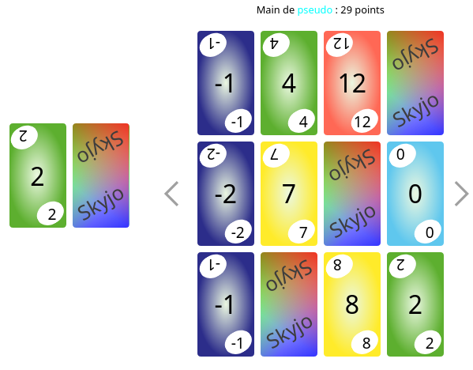
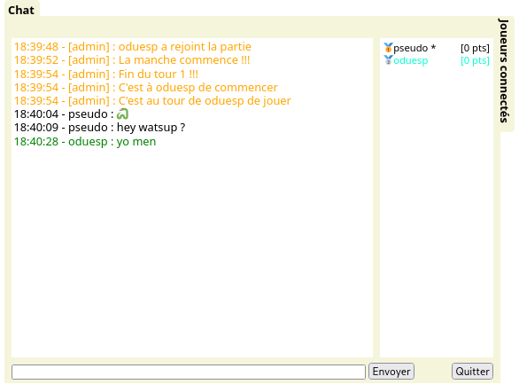
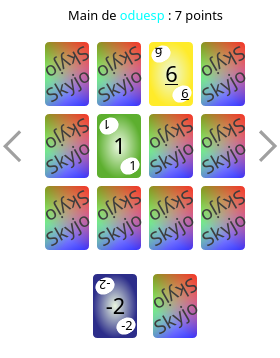
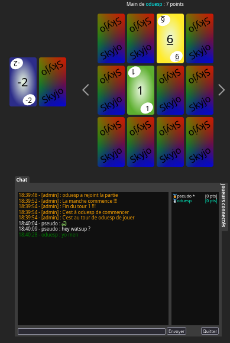

# SKYJO University Web Project

This the SKYJO game in a Website !

## Install

```
git clone https://github.com/Vad3L/Skyjo.git
cd Skyjo
npm install
node .
```

## Usage

### Quick start

Open your favorite browser and type localhost:8080

After you just have to log you.<br>
[](./public/img/login.png)

Once logged you'r in the lobby, here you can create or join a party.<br>
[](./public/img/lobby.png)

After the game launch, you can see the beautiful game board and chat.<br>
[](./public/img/gameBoard.png)
[](./public/img/chat.png)

### Additional Feature

#### Responsive
If you want to play on your smartphone you can to !<br>
[](./public/img/responsive.png)

#### Dark Theme
Your eye's is on fire front of a white screen ?
Don't worry a dark theme is here for you !

Just a little combo of two keys [CTRL+Y] and tou can change theme.<br>
[](./public/img/darkTheme.png)

#### Animation
For a dynamic game, small animations are available.

When you wait in the menu of a party there is a small svg that rotates to occupe you'r eyes.
Or 
When the party start you have a little animation on the chat (BUZZZ).

#### Who Speak ?
To have an even more lively game.

There is a voice synthesizer that gives information to the players:
	-The game starts.
	-The turn is over.
	-This is the last round.
	-It is the player's turn. 

And if your to slow the vocie synthesizer can insult you!

#### CSS GOD 
The beautifull cards are made in CSS

## Author 
Léo Vandrepol<br>
Anthony Gasca-Gimeno


### University tutor
Dorine Tabary
