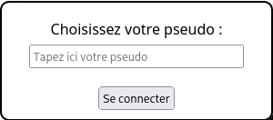

# SKYJO University Web Project

This the SKYJO game in a Website !

## Install

```
git clone https://github.com/Vad3L/Skyjo.git
cd Skyjo
npm install
node .
```

## Usage

### Quick start

Open your favorite browser and type localhost:8080

After you just have to log you.
[](./public/img/login.png)
You just have to login.

Leo Vandrepol 

npm init 

npm install socket.io --save

npm install express --save

npm install selenium-webdriver

npm install sinon
